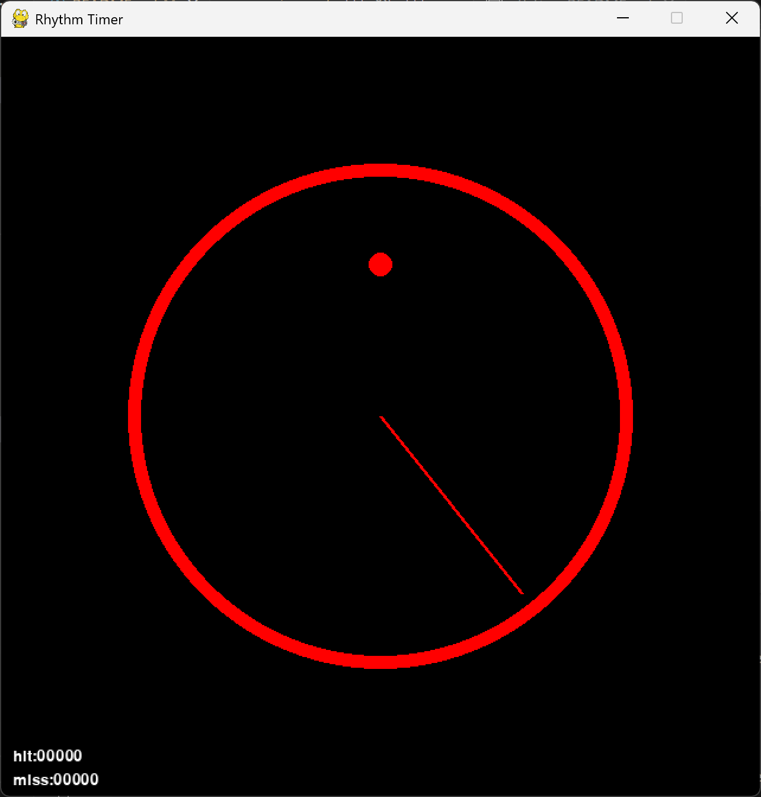
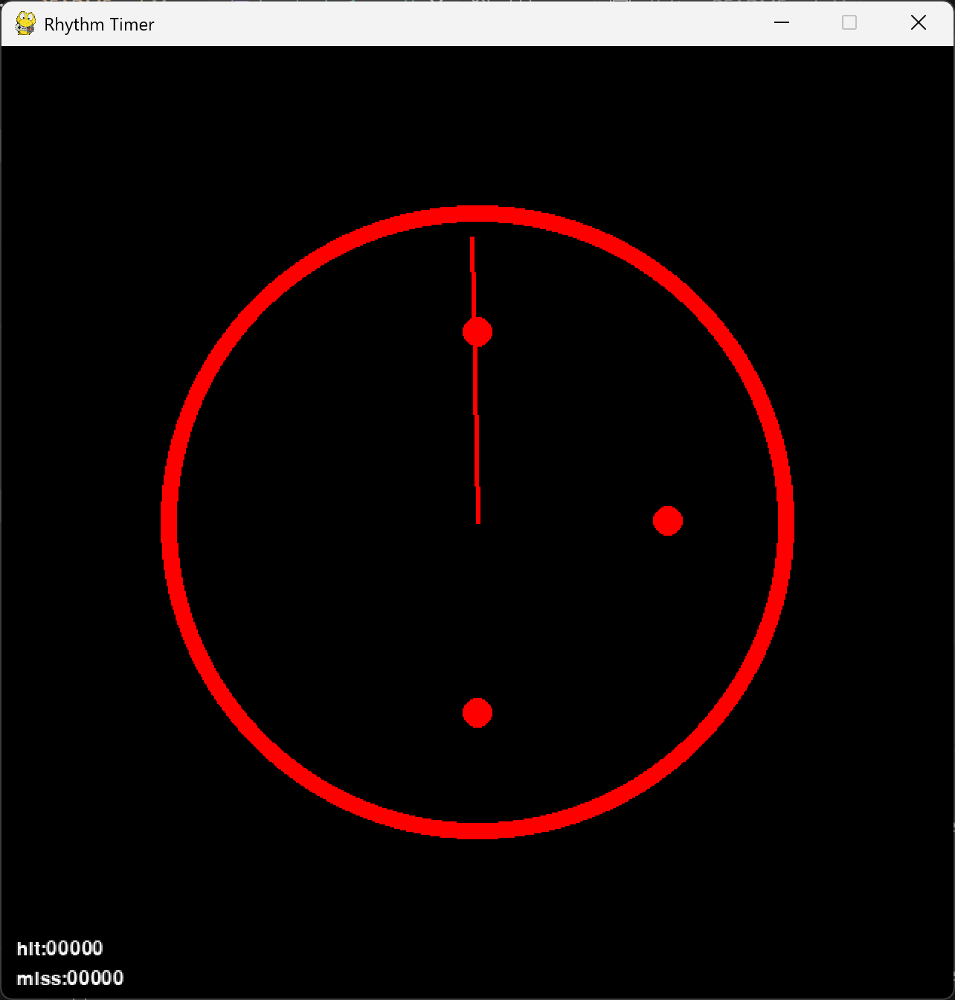
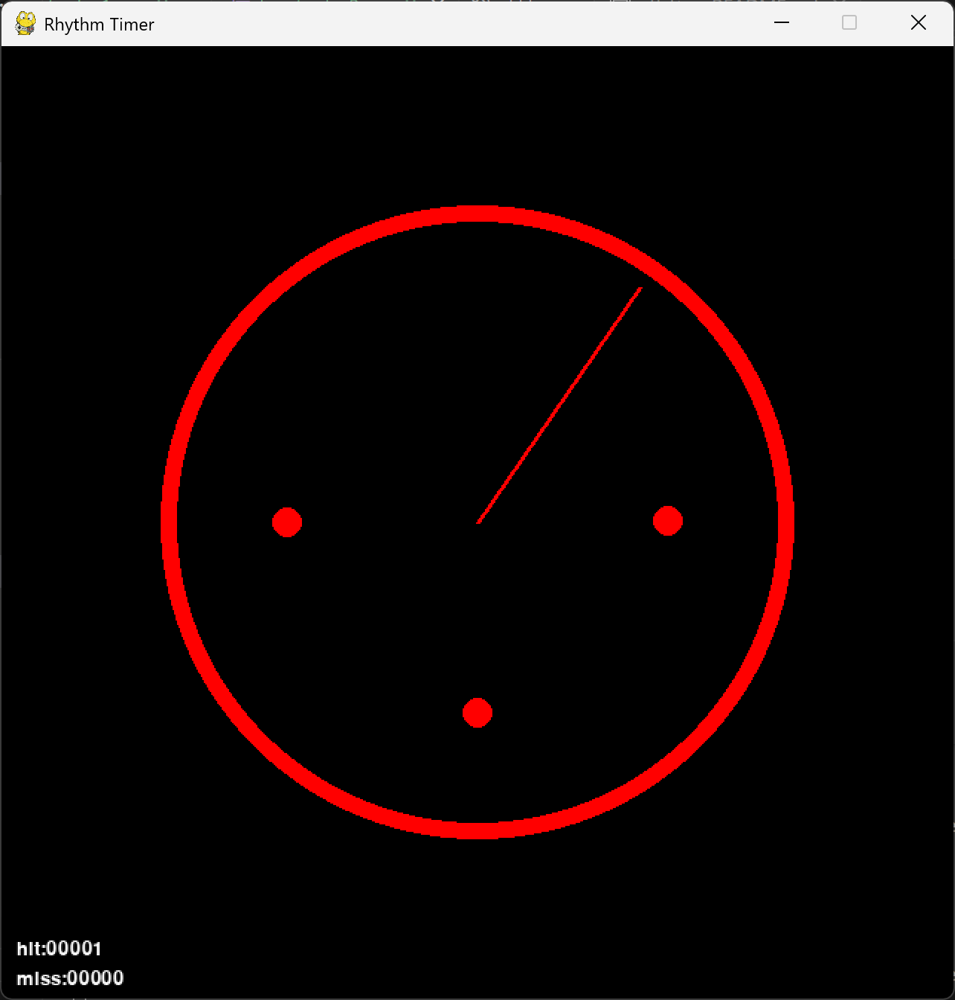

# Rhythm Timer

## 作品概要

このゲームはタイマーをモチーフにしたリズムゲームです．

## 動作環境

- Python 3.13
- Windows (他のOSで動作するかは不明)

## 使用ライブラリ

- pygame

## 実行方法

### 1. pythonのインストール

[ここから](https://www.python.org/downloads/)python 3.13をインストール

### 2. 仮想環境の構築

以下のコマンドを入力して，仮想環境を構築します．

```bash
python -m venv .venv
```

```bash
.venv/Scripts/Activate.ps1
```

### 3. ライブラリのインストール

以下のコマンドを入力してpipを最新のものにします．

```bash
python -m pip install --upgrade pip
```

次に，以下のコマンドを入力してライブラリをインストールします．

```bash
pip install -r requirements.txt
```

### 4. ゲームの実行

以下のコマンドを入力してゲームを実行する．

```bash
python main.py
```

## プレイ方法

ゲームを実行すると，タイマーが表示されます．「ピッ」というカウントダウンの後タイマーの中に塗りつぶされた丸(以下ノーツ)が表示されます．


タイマーの針がノーツと重なるタイミングで，


任意のキーを押下すると，Hitとなり，左下に表示されるhitの数字が1増えます．


針がノーツを通り過ぎてしまうと，Missとなり，missが1増えます．

## 制作期間

2025/12 ~ 2026/01

## 使用させていただいた音楽

Polygons
by Riya ([Youtubeリンク](https://www.youtube.com/@Riya440Hz))

## ディレクトリ構成

```
.
├── assets/         #効果音やBGM
├── codes/          #ゲームの処理
├── docs/           #README.md用の画像素材
├── main.py         #エントリーポイント
└── README.md       #本ドキュメント
```
